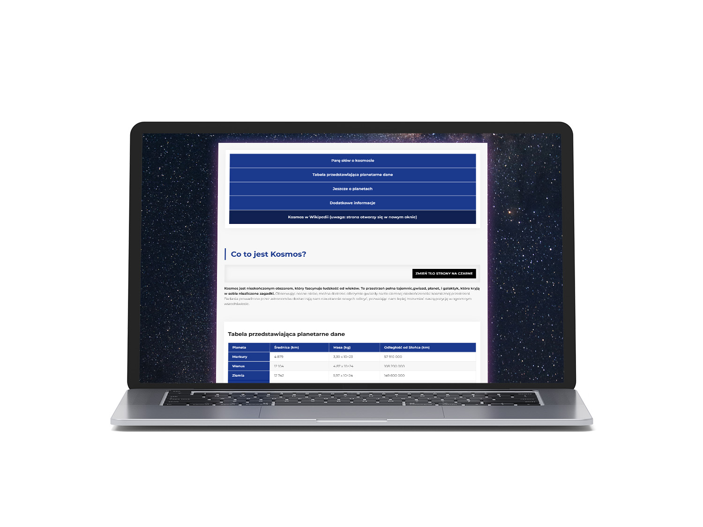

# Homepage
## Description

**A website presenting information about space**.

 The technologies used are: 
 - HTML;
 - CSS;
 - BEM;
 - JavaScript. 
 
 When you click the button, the background of the page changes.

## Demo
[Zobacz demo](https://pawel-paluch.github.io/homepage/).